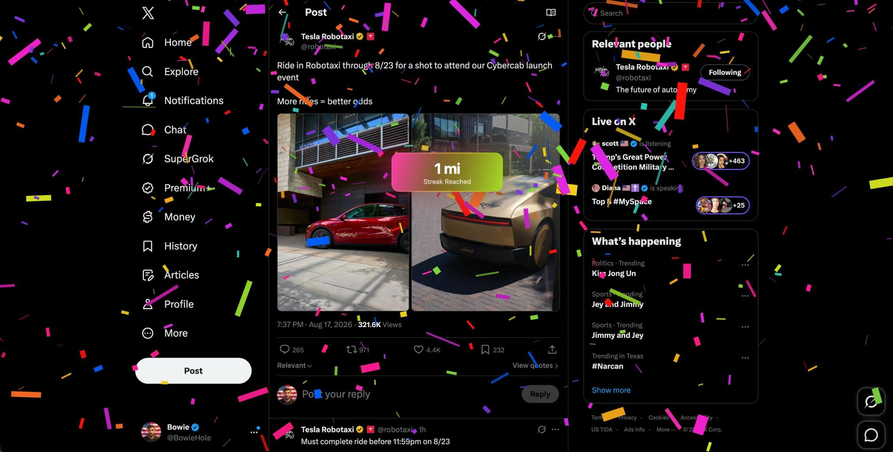

# Streak Confetti

Chrome extension that tracks how far you scroll (or move the mouse) and throws Tesla-style FSD streak confetti at milestones.



By default it only counts **scrolling on [x.com](https://x.com)** (`twitter.com` counts as the same site). You can point it at any other URL.

## Install (unpacked)

This is not on the Chrome Web Store yet. Load it as an unpacked extension:

1. Download or clone this repo.
2. Open Chrome and go to `chrome://extensions`.
3. Turn on **Developer mode** (top right).
4. Click **Load unpacked**.
5. Select the `extension` folder inside this repo  
   (`…/coffeet/extension`).
6. Pin **Streak Confetti** from the puzzle-piece menu so the icon stays visible.
7. Open [x.com](https://x.com) (or your chosen site) and **refresh the tab**.
8. Click the extension icon. Scroll that page. The streak number should climb.

After you reload the extension, refresh any tabs that were already open. Chrome does not always reinject the tracker into old tabs.

It will not run on `chrome://` pages, the Chrome Web Store, or other locked browser pages.

### Permissions

- **Read and change data on websites you visit** — needed to measure scroll/mouse travel and draw confetti on the page.
- **Storage** — saves your streak and settings on this computer.

It stores **distance totals and settings only**, not your cursor path or the content you scrolled.

## How it works

- **Monitor:** Scroll (default) or Mouse.
- **Only on:** `x.com` by default. Change this to any host or URL (`reddit.com`, `x.com/home`, …).
- **Streak:** one running total. It does **not** reset at midnight, when you close the tab, or when you leave the site. Counting just pauses until you come back.
- **Reset:** only if you click **Reset streak**, or if you change the tracked site.

### Auto confetti (FSD ÷ 100)

FSD car milestones are 100 / 250 / 500 / 1,000 / 5,000 / 25,000 miles.  
This extension uses **1 / 100th** of those: **1, 2.5, 5, 10, 50, 250 mi**.

The first mark is timed to **100 FSD miles at 70 mph** — about **1.4 hours** of active feed scrolling. Later marks keep those same ratios. These are streak miles, not a tape-measure of the real world.

### Shortcuts

| Shortcut | Action |
|---|---|
| `Alt+Shift+S` | Fire confetti on this tab |
| `Alt+Shift+C` | Clear confetti |

You can also fire a celebration by hand from the popup (100 / 250 / 500 / 1k / 5k / 25k).

## Local studio (optional)

The repo root is also a standalone confetti generator (no extension required). It does not track scrolling.

```bash
python3 -m http.server 5173
```

Then open [http://127.0.0.1:5173](http://127.0.0.1:5173).

**Studio** (`index.html`) has no URL parameters. Set the number in the Miles field or click a milestone chip.

**Overlay** (`overlay.html`) does take query parameters — that’s the page “Copy overlay link” builds. Example:

```
http://127.0.0.1:5173/overlay.html?miles=1&unit=mi&label=Streak%20Reached&style=tesla&auto=1
```

| Param | What it does | Default |
|---|---|---|
| `miles` | Number on the badge | `1000` |
| `unit` | `mi` or `km` | `mi` |
| `label` | Line under the number | `Streak Reached` |
| `style` | `tesla`, `rain`, `burst`, `cannon` | `tesla` |
| `badge` | `1` show / `0` hide | `1` |
| `density` | How much confetti | `1` |
| `size` | Piece size | `1` |
| `gravity` | Fall speed | `1` |
| `wind` | Horizontal drift | `0` |
| `duration` | Burst length, ms | `6500` |
| `auto` | Fire on load (`0` to wait) | on |
| `loop` | Re-fire every N ms (`0` = once) | `0` |
| `bg` | `transparent`, `black`, `viz` | `transparent` |
| `colors` | Hex list without `#`, comma-separated | Tesla palette |

More examples:

- 1 mile: `overlay.html?miles=1&unit=mi&auto=1`
- 2.5 miles: `overlay.html?miles=2.5&unit=mi&auto=1`
- 5k with viz background: `overlay.html?miles=5000&bg=viz&auto=1`

On the overlay page: Space fires again, `C` clears, click retriggers. Send `{ type: "confetti", miles: 1000 }` via `postMessage` if you embed it.

## Not included yet

- Prestige / rank-up after you finish the ladder
- Chrome Web Store listing
- Firefox / Safari
- Syncing the streak across computers
